# 🎮 Xbox to MA3 - Komplettsystem

Ein professionelles Controller-Interface für GrandMA3 Lichtsteuerung.

## 🚀 Quick Start (3 Schritte)

### 1️⃣ Python Script starten
```bash
python xbox_to_ma3.py
```
- Verbinde Xbox oder PlayStation Controller
- UI zeigt Controller-Status

### 2️⃣ MA3 Plugin installieren
1. Kopiere `XboxControl.lua` nach MA3 Plugin-Ordner
2. In MA3: `Menu → Plugins → Import Plugin`
3. Plugin starten oder auf Executor legen

### 3️⃣ Loslegen!
```
1. Fixtures auswählen (z.B. Group 1)
2. Plugin starten
3. Controller bewegen → Licht folgt!
```

---

## 📦 System-Übersicht

```mermaid
graph LR
    A[🎮 Xbox/PS Controller] -->|USB| B[💻 Python Script]
    B -->|OSC Port 8000| C[🎭 MA3 onPC/Console]
    C -->|Fader Values| D[📜 Lua Plugin]
    D -->|Pan/Tilt/Dimmer| E[💡 Selected Fixtures]
    
    style A fill:#4CAF50
    style B fill:#2196F3
    style C fill:#FF9800
    style D fill:#9C27B0
    style E fill:#F44336
```



**Flow:**
1. Controller → Python liest Input
2. Python → Sendet OSC zu MA3 Fadern
3. Lua Plugin → Liest Fader, schreibt auf Selection
4. Fixtures → Reagieren in Echtzeit

---

## 📁 Dateien im Projekt

| Datei | Beschreibung |
|-------|-------------|
| `xbox_to_ma3.py` | Python Script mit UI |
| `XboxControl.lua` | MA3 Plugin |
| `MA3_SETUP.md` | Detaillierte Plugin-Anleitung |
| `README.md` | Diese Datei |
| `requirements.txt` | Python Dependencies |

---

## 🎯 Features

### Python Script
- ✅ Xbox & PlayStation Controller Support
- ✅ Automatische Controller-Erkennung
- ✅ Visuelles UI (800x600)
- ✅ Echtzeit-Feedback (Joystick, Trigger, Buttons)
- ✅ OSC-Transmission @ 50Hz
- ✅ Hot-Plug Support

### MA3 Plugin
- ✅ **Relativer Modus** (Ego-Shooter Style) - Default
- ✅ **Absoluter Modus** (Direkte Position)
- ✅ Deadzone-Filter (verhindert Stick-Drift)
- ✅ Selection-Aware (steuert immer gewählte Fixtures)
- ✅ Runtime Configuration (Speed, Deadzone, Mode)
- ✅ Dimmer Support via Trigger

---

## ⚙️ Installation

### Python Dependencies
```bash
pip install pygame python-osc
```

### MA3 OSC Setup
1. `Menu → In & Out → OSC`
2. Aktiviere Port **8000** für Input
3. Done!

### Details siehe:
- Python: Hauptdatei `xbox_to_ma3.py`
- MA3: **[MA3_SETUP.md](MA3_SETUP.md)** ← Detaillierte Anleitung

---

## 🎮 Controller Mapping

| Input | MA3 Target | Funktion |
|-------|-----------|----------|
| **Left Stick X** | Page 1, Fader 201 | Pan |
| **Left Stick Y** | Page 1, Fader 202 | Tilt |
| **Right Trigger** | Page 1, Fader 203 | Dimmer |
| **Button A/X** | Page 1, Key 201 | Flash |

---

## 🔧 Konfiguration

### Relativer vs. Absoluter Modus

#### Relativ (Standard) 🎯
```
Stick links drücken → Licht dreht links
Stick loslassen → Licht stoppt
```
✅ Natürlich für Moving Lights
✅ Präzise Kontrolle
✅ Keine Sprünge

#### Absolut
```
Stick links → Licht fährt auf linke Position
Stick Mitte → Licht fährt zur Mitte
```
✅ Schnelles Positionieren
✅ Vorhersagbar

**Modus wechseln:**
```
Lua "ToggleMode()"
```

### Geschwindigkeit anpassen
```
Lua "SetSpeed(5.0)"    # Schneller
Lua "SetSpeed(0.5)"    # Langsamer
```

### Deadzone einstellen
```
Lua "SetDeadzone(10)"  # Größer (weniger empfindlich)
Lua "SetDeadzone(2)"   # Kleiner (empfindlicher)
```

---

## 🎭 Workflow-Beispiel

### Szenario: Show mit verschiedenen Fixture-Gruppen

```
1. Python Script starten → Controller verbunden ✓
2. MA3 Plugin starten

3. Spots steuern:
   Group "Spots"
   → Controller bewegen → Spots folgen
   
4. Zu Washern wechseln:
   Group "Washer"
   → Controller bewegen → Washer folgen
   
5. Alle zusammen:
   Group "All"
   → Alle reagieren gleichzeitig
```

**Pro-Tipp:** Lege das Plugin auf einen Executor-Button!
```
Assign Plugin "XboxControl" at Executor 2.1
```

---

## 🐛 Troubleshooting

### "Kein Controller gefunden"
- Controller anschließen (USB oder Bluetooth)
- Windows: In "Geräte und Drucker" sichtbar?
- Bei PS-Controller: DS4Windows kann helfen

### "Licht reagiert nicht"
- Sind Fixtures selektiert? (`Selection` nicht leer)
- Python UI: Bewegen sich die OSC-Werte?
- MA3: Bewegen sich Fader 201-203?
- OSC Input aktiv? (`Menu → In & Out → OSC`)

### "Stick driftet"
```
Lua "SetDeadzone(10)"  # Größere Deadzone
```

**Mehr Details:** [MA3_SETUP.md](MA3_SETUP.md)

---

## 📚 Weitere Dokumentation

- **[MA3_SETUP.md](MA3_SETUP.md)** - Plugin Installation & Config
- **Code-Kommentare** - Beide Dateien sind ausführlich kommentiert

---

## 🔮 Roadmap / Erweiterungen

Aktuell implementiert: **Pan, Tilt, Dimmer**

Mögliche Erweiterungen:
- [ ] Color Control mit rechtem Stick
- [ ] Gobo/Zoom mit D-Pad
- [ ] Preset Recall mit Buttons
- [ ] Speed Control mit LT/RT
- [ ] Config-File für Custom Mapping
- [ ] Multiple Controller Support
- [ ] Feedback (Controller-Vibration)

---

## 💡 Credits & Support

**Entwickelt für:** GrandMA3 onPC & Console
**Controller:** Xbox, PlayStation (alle Varianten)
**Python Version:** 3.7+
**MA3 Version:** 1.8+

**Lizenz:** Frei verwendbar für Shows und Produktionen

---

## 🎬 Let's Light! 

Jetzt hast du alles, was du brauchst:
- ✅ Python Script mit UI
- ✅ MA3 Plugin
- ✅ Setup-Anleitungen
- ✅ Controller-Support

**Have fun controlling your lights!** 🎮💡✨
